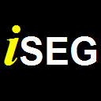

## Description

The Medical Image Segmentation Tool Set (iSEG) is a fully integrated segmentation (including pre- and postprocessing) toolbox for the efficient, fast, and flexible generation of anatomical models from various types of imaging data. iSEG includes a variety of semi-automatic segmentation methods. The key strengths of iSEG are a) a powerful set of tools for manual segmentation (correction), b) support for massive image sizes, c) suport for segmenting complex models with a large number of tissues, e.g. for inserting thin layers. It is the only powerful segmentation platform, which supports color images, e.g. from the [NIH Visible Human](https://www.nlm.nih.gov/research/visible/visible_human.html) or [Visible Korean](https://doi.org/10.1002/ca.20275) projects.

iSEG features a plugin mechanism, which allows users to easily extend the application with custom widgets. The development of iSEG has been driven by the [Virtual Population](https://www.itis.ethz.ch/virtual-population/) project at the [IT'IS Foundation](https://www.itis.ethz.ch/), due to a lack of alternatives amongst open source and commercial tools.

## Compilation instructions

A defined set of 3rd party libraries are required in order to compile iSEG.
Instructions as to how these libraries must be installed and compiled are provided below.

### Required applications

The applications below are needed in order to compile iSEG and its dependencies.

- [CMake:](https://cmake.org/) 3.12 minimum
- C++14 compiler
- [Git](https://git-scm.com/)

### Required 3rd party libraries

The libraries below are required to be compiled and installed on the system in order to compile iSEG. Platform specific instructions for each library are given below.

- Boost, [Boost license](http://www.boost.org/users/license.html)
- HDF5, [BSD-like license](https://support.hdfgroup.org/products/licenses.html)
- ITK, [Apache 2.0 license](https://itk.org/ITK/project/licenseversion1.html)
- VTK, [BSD license](https://www.vtk.org/licensing/)
- Qt 4.8, [GPL3 and LGPL2.1 license](https://www1.qt.io/licensing/)
- EIGEN [MPL2 license](https://www.mozilla.org/en-US/MPL/2.0/)

#### Note
For installing EIGEN just download and extract the [source code](http://eigen.tuxfamily.org/index.php?title=Main_Page#Download)

### Compiling iSEG

- Windows/Visual Studio [instructions](Build/CompilingWindows.md)
- MacOS/Clang++ [instructions](Build/CompilingMacOS.md)
- Ubuntu [github action](.github/workflows/build.yml)
- With Docker images [instructions](Build/CompilingInDocker.md)
